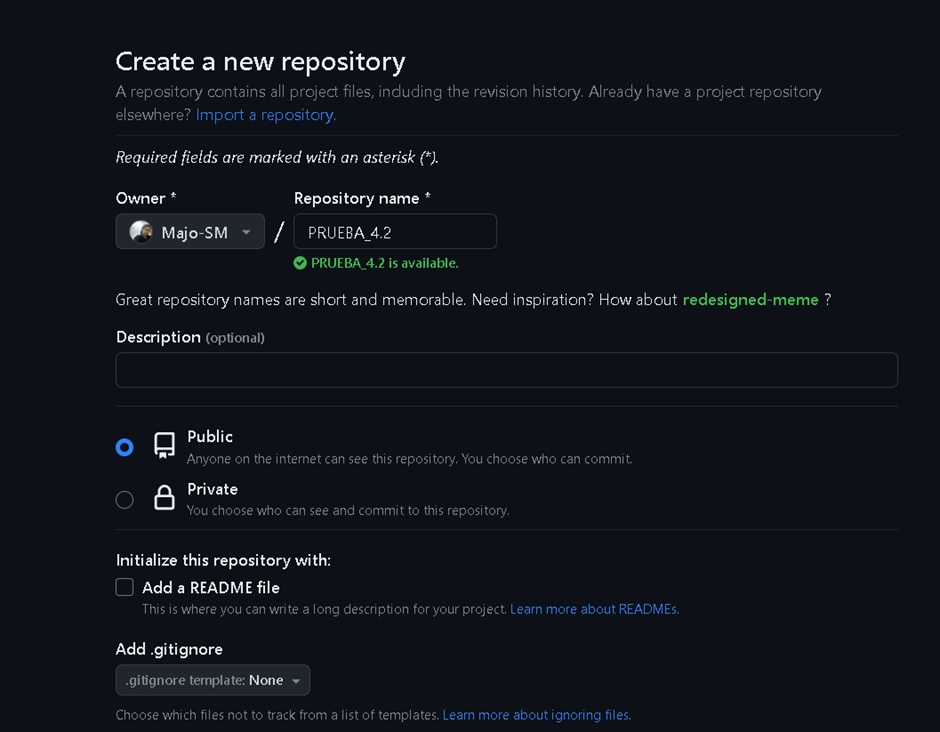
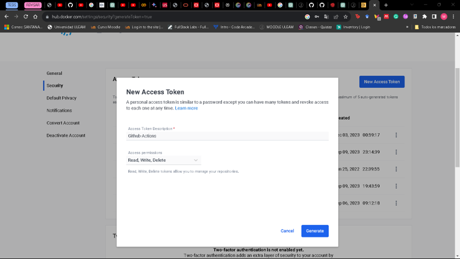
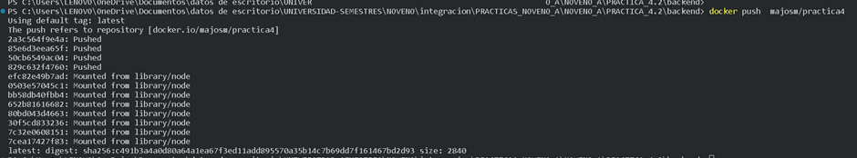
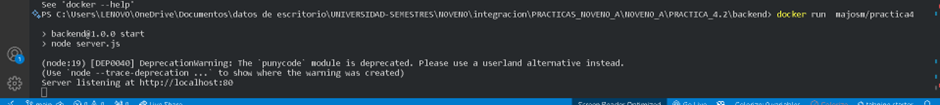
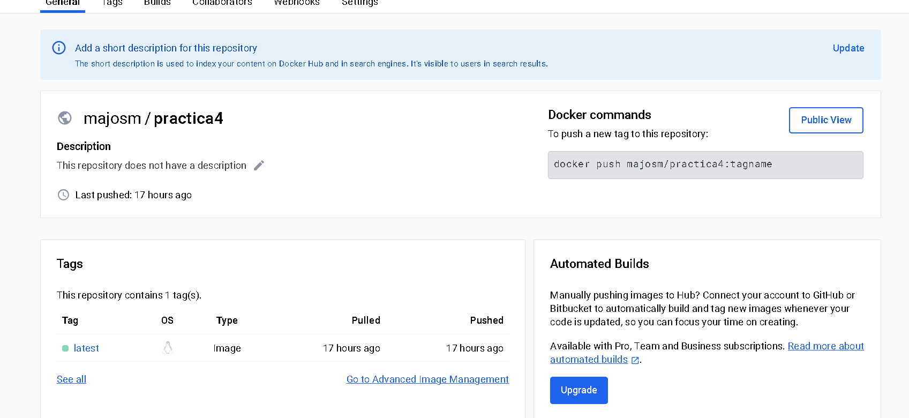
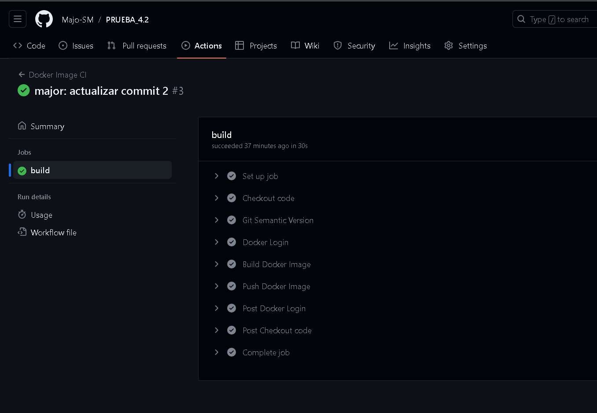
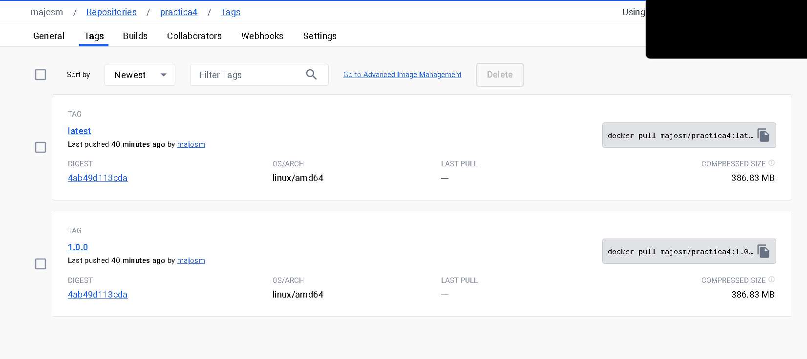
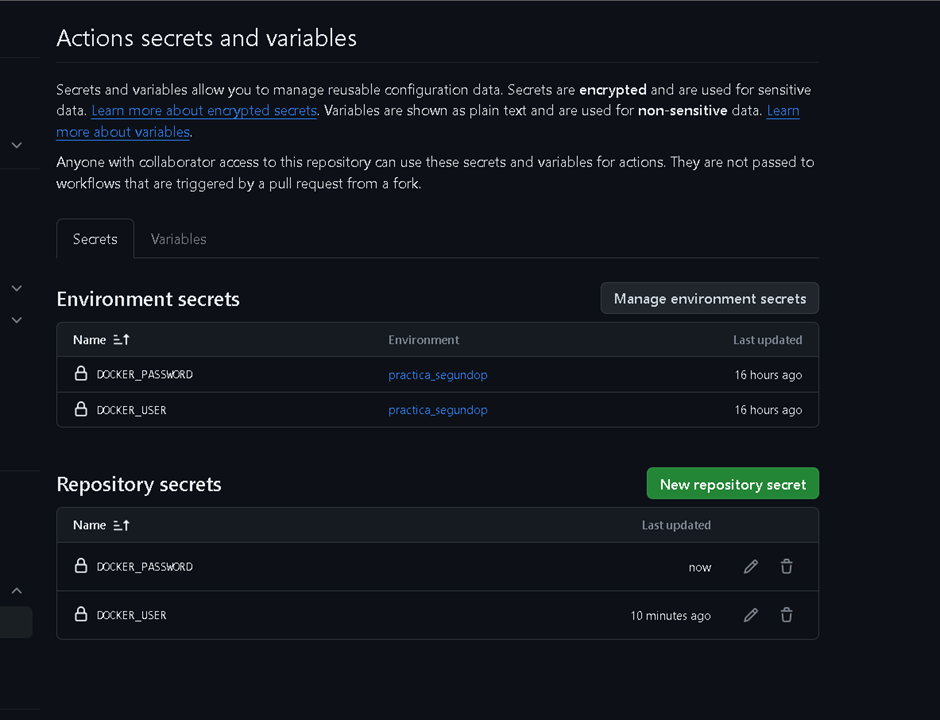
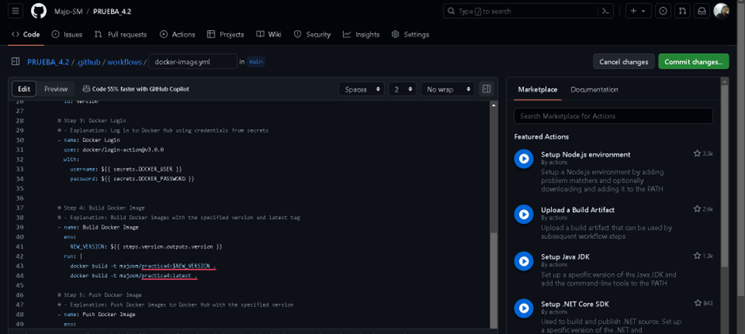
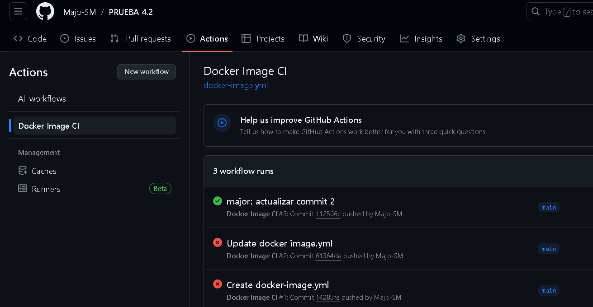

# GitHub Action Push of Images to DockerHub 

## Detalle
En la presente práctica se realizará la demostración de los pasos para subir una imagen de docker de manera automatica a dockerhub y a su ves un versionado del mismo.

## Creación de nuevo repositorio

## Creación de New Access Tokes

## PASOS REALIZADOS: Subida manual de imagenes a DockerHub

## Ejecución de la imagen
Ejecución de la imágen y verificación de la imagen
 

## DockerHub Image
Verificar que la imagen se encuentra en DockerHub.

# Acciones de GitHub
1. Ejecución exitosa de la acción de github
 

2. Demostración de la versión exitosa de la imagen de DockerHub.

## EVIDENCIA DE PRACTICA

