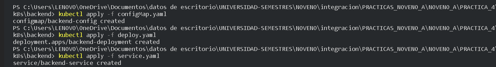

# Integracción de Sistema y Plataformas
## PRÁCTICA IV
### INTEGRANTES 
* LOOR BARRETO BORIS LEONEL
* LÓPEZ BASURTO LARISSA YULIANA 
* MACHUCA CATAGUA NAHOMI ANAHY
*     SANTANA MINAYA MARÍA JOSÉ
* TRIVIÑO RAMOS NICOLLE ALEXANDRA
* VILLAMAR ALCÍVAR MARÍA BELÉN
***

##### A continucación, se adjunta evidencias de la cuarta práctica con el tema: Escalabilidad, Orquestación, Resiliencia y Seguridad, la cual está relacionada con la configuración utilizando Minikube: 

-  Inicio de minikube
 

- aplicamos las configuraciones en los documentos respectivos del mongo y del backend

- estado de su configuración del backend

- mongo

- aplicar cambios en general a la
configuración de deployments

- Exposicion del servicio para comprobación de funcionamiento

